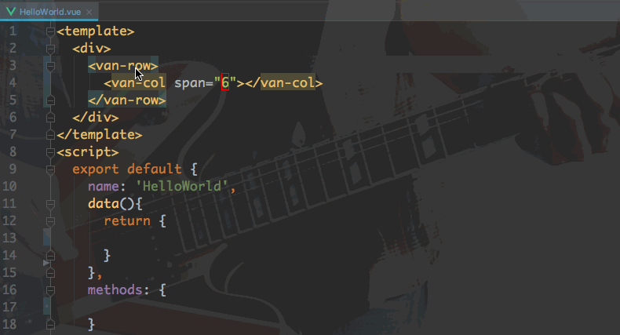
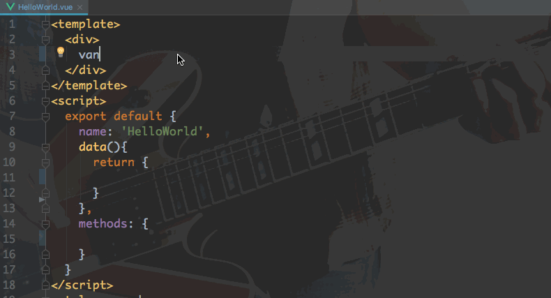
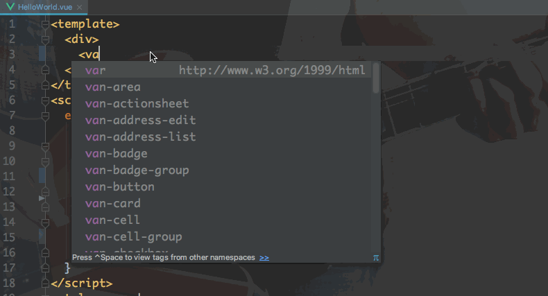
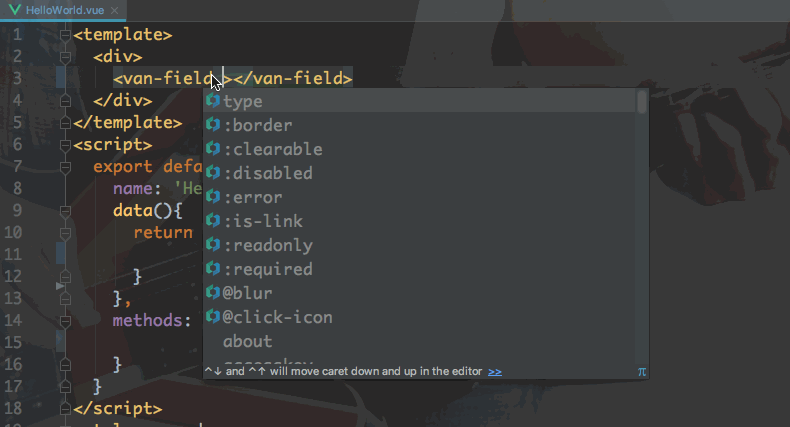
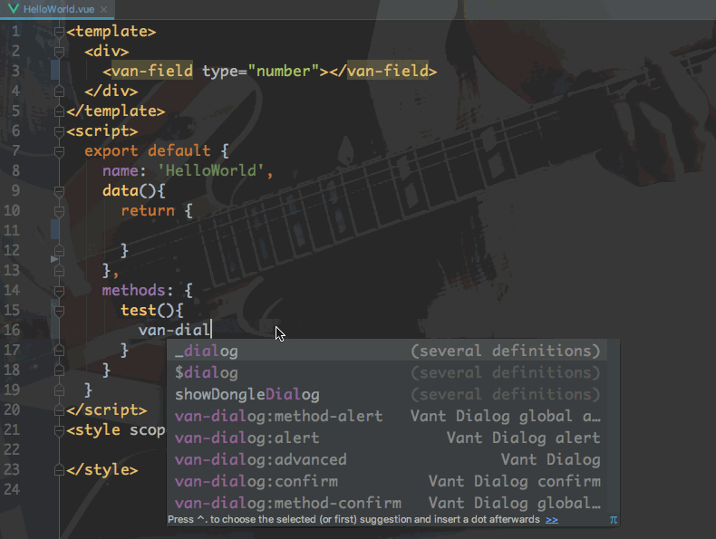
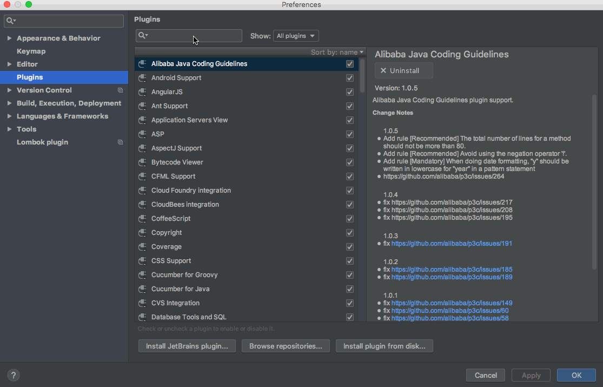

# VantPlugin

## 参照 [https://github.com/jiaolong1021/ElementPlugin](https://github.com/jiaolong1021/ElementPlugin)
## 感谢 [@jiaolong1021](https://github.com/jiaolong1021)

## basic functions
### 1 . see tag document (ctrl + Q at win, ^ + J at Mac)

### 2. live templates (ctrl + space at win, Command + J at Mac)

### 3. edit through tag name

### 4. tag property tip and auto complete

### 5. method tip (begin width van )

## download
if you use WebStorm or IntelliJ IDEA, you can download from plugin repositories.
